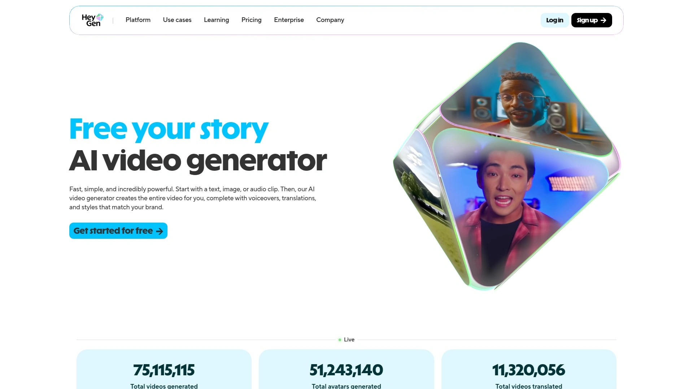

# Latest AI Training Video Platforms Roundup (Including Feature Comparisons)

Employee training videos used to demand cameras, actors, scripts, studios, and editing teams—resources that stretched budgets thin and turned simple updates into multi-week production cycles. AI training video platforms solve this by transforming documents, presentations, and text into professional training content narrated by realistic AI avatars within minutes, no filming required. Whether you're onboarding new hires, rolling out compliance training, or scaling learning content across global teams, these platforms cut production costs by up to 90% while delivering videos in dozens of languages simultaneously.

## **[Colossyan Creator](https://colossyan.com)**

The document-to-video specialist transforming static PDFs into engaging training.

Colossyan Creator built its reputation by doing what most competitors skip—directly uploading PDFs, PowerPoints, and documents then automatically converting them into complete video courses with minimal manual work. The platform provides 150+ AI avatars covering diverse realistic options from formal narrators to friendly presenters, with the ability to create personal AI avatars modeled after your own appearance and voice for consistent branding. Translation support spans 70+ languages with automatic dubbing, making content accessible to global audiences without hiring translators or voice actors. Users can select presenters with matching clothing styles and regional accents to align video appearance with audience culture or professional context.

The AI technology offers templates, AI voices, customizable avatars, screen capture, subtitles, and a brand kit—everything needed for workplace learning. Collaboration features allow multiple team members to work together seamlessly on projects. The beautiful and easy-to-use interface packs endless solutions whether you need training videos, corporate communications, or product demos. Videos are created in less than five minutes with real actors as presenters, making professional content accessible to anyone. The platform supports multilingual scripts, custom branding, and various aspect ratios to suit different platforms.

Major companies trust Colossyan for transforming training—AmeriSave replaced repetitive out-of-date training with engaging AI videos, Illinois Principals Association creates professional training, AFNB GmbH scales neuroscientific training cost-effectively, DSV became 50% more efficient streamlining onboarding, TM Forum creates effective e-learning in days instead of weeks, and Sonesta cut 80% of their video production costs. Users consistently praise the ease of content updates and cost savings, with one developer noting the AI technology and translation capabilities revolutionized their training processes especially in multi-lingual environments. For anyone drowning in static training documents needing video transformation fast, Colossyan's document upload capability delivers results competitors requiring manual scripting can't match.

## **[Synthesia](https://www.synthesia.io)**

The enterprise standard with 240 avatars and Fortune 100 trust.

Synthesia dominates the enterprise AI video space with over 60% of Fortune 100 companies using the platform to create training, marketing, and communications videos. The platform eliminates cameras, actors, and studios entirely—users input scripts, select from 240+ realistic AI avatars, and the AI generates fully synthesized videos with lifelike lip-syncing in 140+ languages and accents. Founded in 2017 and based in London, Synthesia supports automatic translation making it essential for global enterprises scaling content production across borders. Users create content via pre-generated AI presenters or digital representations of themselves through the platform's AI video editing tool.

The platform shines in corporate training, e-learning, marketing, and internal communications where professional-quality videos need consistent delivery without expensive equipment or editing skills. One-click video updates mean no broken links or duplicate files—every version syncs automatically to the original video. Screen recordings get instant transcripts without "ums" or "uhs," with instant editing, updating, and translation capabilities. The multilingual player organizes and displays all 140+ language versions in a single interface. Videos export in SCORM format for any learning management system with automatic syncing to keep content current.

Synthesia 3.0 introduced groundbreaking features including AI-generated b-roll footage, voice cloning capabilities, and enhanced expressiveness in avatars. The AI Video Assistant helps generate video drafts from prompts, URLs, or documents automatically. Analytics provide views, drop-offs, and completion rates so you can optimize every video beyond just generating content. The platform prohibits non-consensual clones including celebrities or political figures, requiring explicit consent plus strict pre-screening to avoid deepfaking. Pricing sits in premium territory reflecting the enterprise focus, though the comprehensive feature set and proven track record justify the investment for organizations needing scale.

## **[HeyGen](https://www.heygen.com)**

The interactive avatar pioneer with real-time conversation capabilities.

HeyGen established itself as the go-to tool for AI avatar videos with one killer feature most competitors lack—interactive avatars that have real-time conversations, effectively functioning as video chatbots. The platform offers over 300 diverse stock avatars or lets you create custom clones by uploading videos or photos, with motion controls for adjusting facial expressions and movements to match your exact message. Translation capabilities span over 175 languages and dialects with automated API support, which content creators used to great effect when translating TikTok videos to Chinese during the RedNote migration—realistic enough to fool followers if they weren't watching closely.

The free plan actually delivers usable value unlike many competitors—one custom video avatar, three videos up to three minutes monthly, 30+ languages, and 720p export. The Creator plan at $24 monthly (billed annually) removes watermarks, unlocks the full language library, and provides unlimited videos up to five minutes each. Team plans run $30 per user monthly with a two-user minimum, expanding maximum video length to 30 minutes and adding collaborative workspace features. HeyGen carries NSF Certified for Sport designation, meaning independent third-party testing confirms contents match labels with no banned substances—critical for athletic organizations.

The face swap video tool maintains unmatched precision and realism, preserving natural expressions, lighting, and details whether creating content for entertainment or marketing. With over 1000 avatars available and the ability to pair face swaps with voice cloning for fully immersive experiences, HeyGen solved the realism problem that makes most AI videos feel robotic. The platform integrates with Canva and other creative tools, streamlining workflows for designers who want AI avatars without leaving their primary workspace. For training departments wanting avatars that can actually interact with learners rather than just deliver monologues, HeyGen's conversational capabilities push beyond standard video generation.

## **[Elai.io](https://elai.io)**

The corporate learning specialist with built-in interactive quizzes.

Elai.io specializes in AI-powered video generation for employee learning, trusted by over 2000 clients including Fujitsu, Beiersdorf, and Generali. The platform allows generating interactive video content narrated by digital human presenters in minutes without cameras, studios, or green screens. Users can generate training videos from text or URL inputs, translate videos into 75+ languages in seconds, and craft training scripts from scratch with AI Storyboard. The interactive quiz and workflow features enhance viewer engagement beyond passive watching, making it particularly effective for corporate learning environments where knowledge retention matters.

The platform offers 80+ high-quality avatars with the ability to create custom digital avatars from videos or photos, plus voice cloning in 28+ languages. Multiple avatars can appear in videos for dynamic conversations and scenario-based learning, bringing realistic workplace simulations to training content. Founded in 2021, Elai.io offers comprehensive AI video generation with customizable digital presenters supporting over 75 languages and 450 accents for global reach. Video generation from URLs creates content directly from web pages, saving significant time and effort.

AI script crafting uses GPT capabilities to generate compelling video scripts, while professional video templates provide quick starting points for polished creation. Screen recording integrates into videos for tutorials and demos, combining live captures with AI narration. The user-friendly platform designed for conversational avatar videos helps businesses produce content with minimal effort, eliminating expensive studios, equipment, and real actors. Regular platform updates ensure access to the latest features and improvements for staying current with AI video technology. Powered by Panopto, Elai.io brings enterprise-grade reliability to AI video generation, with a focus specifically on learning and development use cases rather than general marketing.

## **[Hour One](https://hourone.ai)**

The cinematic avatar creator powering NVIDIA's CEO demonstrations.

Hour One created a lifelike avatar of NVIDIA founder Jensen Huang capable of generating messages in multiple languages with cinematic-level realism, showcased during NVIDIA's Computex keynote. The sophisticated AI video cloud infrastructure parallelizes inference and 3D video rendering, enabling rich-media pipelines at infinite scale powered by NVIDIA GPUs and AI acceleration libraries. The new GPU micro-orchestration technology enables complex inner flows of audio-visual sequences, managing and optimizing multi-modal Gen-AI processes simultaneously for seamless efficient operations.

The platform's hyper-realistic, natural AI avatars revolutionized video creation and script generation, offering seamless transition from text to dynamic videos. Designed for businesses and professionals, Hour One simplifies production of high-quality videos allowing users to generate consistently branded content across organizations with just a few clicks. Videos can be created quickly without professional videographers or complex equipment, leveraging video power to retain audience attention and improve message recall. Users save up to 90% of time and budget compared to traditional video production methods.

The plug-and-play platform suits users without design or editing skills, though new users may require time to get accustomed to various features and capabilities. The multi-cloud adaptive GPU autoscaling system scales across multiple compute pipelines including rendering, graphics, and inference, managing GPU allocation on all major clouds atop Kubernetes to maximize resource utilization, performance, and cost-efficiency. Self-help guided tutorials ensure smooth transition into using platform features for creating professional videos. For organizations wanting the highest-end cinematic quality in AI avatars, Hour One's infrastructure and partnerships with companies like NVIDIA deliver production values that simpler platforms can't replicate.

## **[D-ID](https://www.d-id.com)**

The viral sensation that brought historical figures to life.

D-ID unleashed Deep Nostalgia, the internet phenomenon that captivated millions by animating historical figures and family ancestors into lifelike videos. The Creative Reality Studio uses generative AI to create avatar-driven videos with photo-based, video-based, or custom-generated avatars ideal for marketing, training, or storytelling. Advanced speech synthesis and facial animation models match lip movement and expressions with speech in real-time, ensuring human-like synchronization that feels natural and fluid. Support for 120+ languages with multilingual voice capabilities means you can create avatar videos speaking different languages and accents perfect for global audiences or localized marketing.

The streamlined editing suite manages video production effectively with multiple scenes, templates, and layered media elements including images, videos, backgrounds, shapes, and text. You can directly edit, resize, and adjust media on the canvas, with the platform built for speed—creating high-quality videos in minutes instead of days. D-ID recently partnered with Spring ACT, a Swiss non-profit, to bring an untraceable chatbot to life enabling domestic violence victims to talk to a photorealistic avatar in 13 languages, showcasing the technology's humanitarian applications.

Every detail stays in your control from avatar appearance to voice and language, letting you tailor each video to match your brand and message. The platform replaces expensive video shooting with AI efficiency, delivering professional-grade results at a fraction of traditional production costs. Integration works smoothly with favorite tools and platforms so you can create and deploy videos without workflow disruption. Whether making one video or one thousand, D-ID handles volume without sacrificing quality or creativity, scaling infinitely once you establish your template. The free plan includes a watermark with up to 5 minutes of video, while paid plans start at $16 monthly.

## **[Pictory AI](https://pictory.ai)**

The blog-to-video converter with 3 million stock clips.

Pictory AI transforms text into videos quickly and easily—just upload scripts, articles, blog posts, or visuals and Pictory converts them into professional videos with few clicks. The platform includes high-quality AI voice narration, subtitles, captions, and ability to instantly resize content for YouTube, vertical shorts, and other social media platforms. Access to over 3 million high-quality video clips and images from Storyblocks represents huge value since Storyblocks subscriptions normally cost around $30 monthly, all included with Pictory.

Automated video creation saves time by handling complex, time-consuming tasks like editing footage, adding graphics, and recording voiceovers automatically. The intuitive interface requires no video, editing, design, or tech skills—type a script or upload a blog post and let AI go to work, making professional video creation achievable for beginners. Videos are optimized for marketing and social media using best practices to maximize viewership, shares, and engagement. The scalable production means AI technology minimizes laborious manual work, enabling unlimited video creation cost-effectively.

Customizable branding personalizes videos with brand colors, logos, fonts, and more through templates, creating consistent on-brand videos reinforcing visual identity. The platform excels at turning long-form content like blog posts into shareable marketing and social media videos rapidly. Share brand stories through video storytelling designed to captivate audiences, with videos created using optimization techniques for maximum impact. Free plans exist with limitations allowing three video projects up to 10 minutes each, while paid subscriptions start at $19 monthly unlocking advanced capabilities. For training departments with existing written content needing quick video adaptation, Pictory's text-to-video strength delivers results fast.

## **[Loom](https://www.loom.com)**

The screen recording champion for tutorial-style training.

Loom dominates the screen recording space with over 25 million people across 400,000 companies using the platform for training videos, tutorials, and onboarding. The free plan lets you record up to 25 videos per person, making it accessible for teams testing video training before committing budgets. Loom records your screen with audio while using your camera to add a personal touch, capturing sharp 1080p or up to 4K resolution. Quick setup with intuitive UI means you can start recording immediately without learning complex software.

AI-powered efficiency boosts productivity with automatically generated titles, chapters, and CTAs speeding up content creation. Instantly re-record videos with Live Rewind feature—if you make a mistake mid-recording, rewind and redo that section instead of starting over entirely. Engage viewers with comments and emojis, allowing learners to provide feedback directly on specific moments within videos. Trim and edit recordings directly in Loom without exporting to third-party software, while automatic transcription generates captions you can manually edit for accuracy.

The browser-based editing tool activates automatically when you finish recording, letting you cut out mistakes through the transcript, insert calls to action, add thumbnails, and add virtual backgrounds. Loom's AI-based video editing features automatically remove filler words like "ums," "ahs," and pauses with a single click. Share videos instantly with trackable links—share the link once, then update your video as needed without generating new URLs. Organize and store videos with easy management, embedding them in training materials, LMS platforms, or sharing via Slack and email. For training teams creating process documentation, software walkthroughs, and onboarding sequences, Loom's screen recording focus delivers exactly what traditional avatar platforms can't.

## **[Vidyard](https://www.vidyard.com)**

The sales and marketing specialist with AI avatar scaling.

Vidyard brings AI avatars specifically to sales and marketing teams needing personalized video messages at scale. The AI Avatars feature lets you create videos from your Vidyard library, choosing custom or stock avatars then generating videos in either fullscreen or screen-plus-avatar formats. Custom avatars require the AI Avatars add-on or Enterprise plan, but stock avatars work on lower tiers. You can create videos directly from the browser extension while browsing, using specific websites as video backgrounds for context.

Generate AI videos within Gmail, Outlook, and other email clients without leaving the compose window—select an avatar, enter your script, and the video embeds directly in your message. This seamless integration makes video prospecting realistic for busy sales teams who won't context-switch to separate applications. Record a 1-minute clip of your voice that your custom avatar will lip-sync to, creating personalized messages that scale without recording each video individually. The platform supports bulk video generation through campaigns, automating cold outreach, prospect follow-ups, and meeting reminders with personalized AI-generated videos that boost engagement.

Video format options include avatar-only selfie-style videos or screen-plus-avatar mimicking screen sharing using backgrounds you select. Enter scripts manually, explore templates, or ask AI to generate scripts for you based on goals. Track viewer behavior and optimize videos for better results with analytics showing who watched, how long, and which sections they replayed. Vidyard pricing requires contacting sales for custom quotes based on team size and needs. For revenue teams wanting AI video capabilities focused specifically on pipeline generation rather than general training, Vidyard's sales-optimized features and CRM integrations deliver targeted functionality.

## FAQ

**Can AI training video platforms handle existing documents and presentations?**
Most leading platforms including Colossyan, Synthesia, and Pictory support uploading PDFs, PowerPoint files, and documents that automatically convert into video scripts and scenes. Some platforms preserve original slide layouts while others generate new templates based on content, depending on which approach fits your needs better.

**How long does it take to create a training video from scratch?**
Generation times typically range from 5-15 minutes for a complete training video once you've uploaded content and selected avatars. Platforms like Colossyan and Elai.io emphasize sub-five-minute creation for standard videos, while more complex projects with multiple scenes, custom avatars, or interactive elements may take 15-30 minutes.

**Do these platforms integrate with learning management systems?**
Most enterprise-focused platforms including Synthesia, Colossyan, and Elai.io offer LMS integrations with SCORM export capabilities, allowing videos to embed directly into existing training systems with progress tracking and completion analytics. This ensures videos work within current infrastructure rather than requiring separate systems.

## Conclusion

The AI training video revolution transformed corporate learning from expensive production processes into rapid content creation anyone can manage. These platforms range from document converters to interactive avatar systems, with pricing and features matching everything from startup budgets to enterprise requirements. **[Colossyan Creator](https://colossyan.com)** leads this roundup by solving the document transformation problem most training teams actually face—taking existing PDFs, PowerPoints, and manuals then converting them into engaging videos narrated by professional AI avatars in under five minutes, with 70+ language support and collaborative features that make global training rollouts manageable. Whether you need compliance videos, onboarding sequences, or product training, the right AI platform turns static documents into dynamic learning experiences that employees actually complete.
